# data_analysis

[TOC]

本项目为openct中的子项目，通过分析opentc测试平台中的课程（“智能计算素养”）来进行数据分析。需要注意的是，数据分为结果数据和过程数据两部分，目前处理的为结果数据。并且参与测试的有一所初中和一所高中，这里对初中和高中的数据进行分别处理。

## 数据处理

首先，从后台获得的原始数据以每个学生作为索引（index），并且包含非常多的属性。其中有意义的属性为：


| 属性名称     | 属性实例                                                     | 属性意义         |
| ------------ | ------------------------------------------------------------ | ---------------- |
| start_time   | 2021-06-24T09:44:29+08:00                                    | 开始填写的时间   |
| expire_time  | 2021-06-24T11:44:29+08:00                                    | 过期时间         |
| stop_time    | 2021-06-24T10:33:05+08:00                                    | 提交的时间       |
| school       | 区二中实验初中  ｜  南溪一中（高中）                         | 测试学生所在学校 |
| task_answers | ["{\"frame\":{\"level\":\"easy\",\"data\":{\"successRate\":1,\"minJumps\":2,\"jumps\":2,\"path\":[2,0,1]}}}","{\"frame\":{\"level\":\"medium\",\"data\":{\"successRate\":1,\"minJumps\":2,\"jumps\":2,\"path\":[3,1,0]}}}","{\"frame\":{\"level\":\"easy\",\"data\":[\"00\",\"01\",\"02\",\"06\"]}}","{\"frame\":{\"level\":\"medium\",\"data\":[\"00\",\"01\",\"02\",\"03\"]}}","{\"frame\":{\"level\":\"easy\",\"data\":[[0,0,0,0,0,0,0],[0,0,1,0,0,0,0],[0,0,0,0,0,0,0],[0,0,0,0,0,0,0],[0,0,1,0,0,0,1]]}}","{\"frame\":{\"level\":\"easy\",\"data\":[\"C_B\",\"A_C\"]}}","{\"frame\":{\"level\":\"medium\",\"data\":[\"B_A\",\"C_A\",\"G_F\",\"D_B\",\"E_B\"]}}","{\"frame\":{\"level\":\"easy\",\"data\":[[[0,4],[0,5],[1,5]],[[0,1],[0,2],[1,2]],[[0,6],[0,7],[1,7]],[[0,10],[0,11],[1,11]]]}}","{\"frame\":{\"level\":\"medium\",\"data\":[[[3,3],[4,3],[5,3],[5,4]],[[0,4],[1,4],[2,4],[2,5]],[[0,0],[1,0],[2,0],[2,1]],[[0,2],[1,2],[2,2],[2,3]],[[3,0],[4,0],[5,0],[5,1]]]}}","{\"frame\":{\"level\":\"easy\",\"data\":[\"06_05\",\"02_09\"]}}","{\"frame\":{\"level\":\"medium\",\"data\":[\"v_16_v_7\",\"v_2_v_6\",\"v_16_v_8\"]}}","{\"frame\":{\"level\":\"easy\",\"data\":[[{\"row\":0,\"col\":0},{\"row\":1,\"col\":2},{\"row\":2,\"col\":1},{\"row\":0,\"col\":2},{\"row\":2,\"col\":4}]]}}","{\"frame\":{\"level\":\"medium\",\"data\":[[{\"row\":2,\"col\":2},{\"row\":1,\"col\":3},{\"row\":1,\"col\":1},{\"row\":0,\"col\":4},{\"row\":2,\"col\":5}]]}}","{\"frame\":{\"level\":\"easy\",\"data\":[2,1]}}","{\"frame\":{\"level\":\"medium\",\"data\":[1,2,1,0,0,0]}}","{\"frame\":{\"level\":\"easy\",\"data\":{\"stamps\":[1,0,1,2],\"start\":1,\"end\":16,\"selected\":true}}}","{\"frame\":{\"level\":\"medium\",\"data\":{\"stamps\":[2,1,1,1],\"start\":6,\"end\":16,\"selected\":true}}}","{\"frame\":{\"level\":\"hard\",\"data\":{\"stamps\":[1,0,1,2],\"start\":1,\"end\":4,\"selected\":false}}}","{\"frame\":{\"level\":\"easy\",\"data\":{\"rotation\":[[0,2,0]],\"lowered\":null}}}","{\"frame\":{\"level\":\"medium\",\"data\":{\"rotation\":[[2,2,0,0,0,0]],\"lowered\":null}}}","{\"frame\":{\"level\":\"hard\",\"data\":{\"rotation\":[[null,null,1,1,1,0],[2,2,0,null,0,null],[null,2,null,null,0,null],[2,0,2,1,null,null]],\"lowered\":[3,3]}}}","{\"frame\":{\"level\":\"easy\",\"data\":{\"sequence\":[1,0,1,0,0,1,1],\"transformation\":[[0],[0,1]]}}}","{\"frame\":{\"level\":\"medium\",\"data\":{\"sequence\":[1,1,0,0,1,1],\"transformation\":[[0,1],[1,0]]}}}"] | 提交的数据       |

### task_answers解析

每个task_answers 由23个frame组成，每个frame代表一个试题，总共23道试题，每个frame中包含有索引为‘data’的主数据。其中frame的格式有以下三种情况：

1. None，即回话超时，数据帧为空。
2. {'data':{'successRate': 1, 'minJumps': 2, 'jumps': 2, 'path': [2, 0, 1]}}，即数据内容外层包了一层字典
3. {'successRate': 0, 'minJumps': 2, 'jumps': 3, 'path': [1, 2, 3, 4]}，即没有data索引，直接为数据内容


总共23个题目以0～22标号，题目提交答案格式有以下几种：

0，1为：{'successRate': 1, 'minJumps': 2, 'jumps': 2, 'path': [2, 0, 1]}

2，3为：['00', '01', '02']

4为：[[0, 0, 0, 0, 0, 0, 0],
   [1, 0, 1, 0, 0, 0, 0],
   [0, 0, 0, 0, 0, 0, 0],
   [0, 0, 0, 0, 0, 0, 0],
   [1, 0, 0, 0, 0, 0, 0]]

5为：['B_A', 'C_A']

6为：['B_A', 'C_A', 'G_F', 'D_B', 'E_B']

7为：[[[0, 1], [0, 2], [1, 2]],
   [[0, 4], [0, 5], [1, 5]],
   [[0, 6], [0, 7], [1, 7]],
   [[0, 10], [0, 11], [1, 11]]]

8为：[[[1, 0], [2, 0], [3, 0], [3, 1]],
   [[2, 3], [3, 3], [4, 3], [4, 4]],
   [[0, 4], [1, 4], [2, 4], [2, 5]],
   [[0, 1], [1, 1], [2, 1], [2, 2]],
   [[3, 2], [4, 2], [5, 2], [5, 3]]]

9为['09_02', '05_06']

10为['v_14_v_6', 'v_2_v_16', 'v_15_v_12']

11，12为[[{'row': 0, 'col': 0},
    {'row': 1, 'col': 2},
    {'row': 2, 'col': 1},
    {'row': 0, 'col': 2},
    {'row': 2, 'col': 4}]]
    
13为 [2, 1]

14为[1, 2, 1, 2, 2, 3]

15为{'stamps': [1, 0, 1, 2], 'start': 1, 'end': 16, 'selected': True}}

16为{'stamps': [2, 1, 0, 1, 0],
   'start': 1,
   'end': 5,
   'selected': False}

17为{'stamps': [2, 1, 0, 1], 'start': 1, 'end': 5, 'selected': False}

18为{'rotation': [[1, 0, 1]], 'lowered': [0, 0]}

 {'rotation': [[2, 2, 0]], 'lowered': None}

19为{'rotation': [[0, 0, 1, 3, 0, 1]], 'lowered': None}

 {'rotation': [[2, 3, 1, 0, 0, 1]], 'lowered': [0, 2]}

20为{'rotation': [[None, None, 1, 1, 1, 0],
    [1, 1, 3, None, 0, None],
    [None, 1, None, None, 0, None],
    [1, 1, 1, 0, None, None]],
   'lowered': None}

21为{'sequence': [1, 0, 1, 0, 0, 1, 1],

   'transformation': [[0], [0, 1]]}

22为{'sequence': [1, 1, 0, 0, 1, 0, 1],

   'transformation': [[0], [1, 0]]}

### 处理结果和输出文件

首先将task_answers中的内容提取出来（剔除所有的索引文字）

按照学校分为三类装在三个文件夹里：`/output/default`, `/output/junior`, `/output/senior`

default中存有初中和高中所有学生的数据

junior中存有初中的数据

senior中存有高中的数据

所有存储的excel分为两类：

1. `i.xlsx` 

该文件中存储第i个题目的对应用户用户答案的编码（已经去除文字描述）

举个例子：


只有两列数据，第一列为对应学生`index`，第二列为删去所有文字描述的回答编码。

2. `i_count.xlsx`

该文件中存储第i个题目中的各种答案的编码和对应答案的出现次数

举个例子：


有两种情况，如果计算了正确率，则有四列，如上图所示，`count`代表对应回答出现的次数，`success`表示这种回答是否正确（现在只有第0，1题有是否回答正确的标签，所以现在只有`0_count.xlsx`, `1_count.xlsx`中有`success`这一属性。0代表回答错误，1代表回答正确）

## 数据分析

### 做题时长

原始数据中有学生答题的开始时间和结束时间，通过计算时间差得出做完23道题的时长，单位为秒。

同上，仍是将原始数据分为三部分进行分析：全部数据（all）、初中学生（junior）、高中学生（senior）的分布情况并对比，最终绘图为html格式，需要使用浏览器查看。

对于全部数据（all）、初中学生（junior）、高中学生（senior）各自的分布情况存储在：`plot\default\time.html`, `plot\default\time.html`, `plot\default\time.html`，如下所示：

1. 全部数据（all）的做题时长分布（-1为超时数据）


2. 初中学生（junior）


3. 高中学生（senior）

   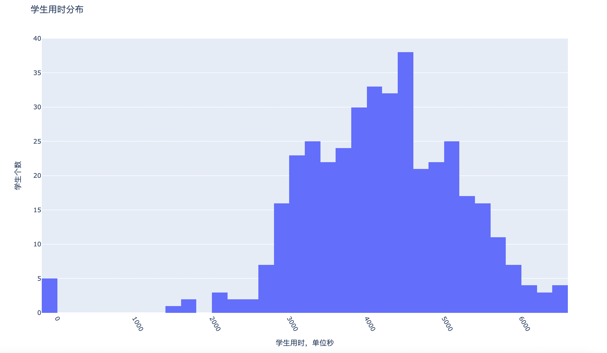

将三类数据放在一起展示：


### 每道题的编码种类

如上面所阐述的那样，编码种类和每种多少学生存储在`/output`中的excel表格中，23道题的编码种类柱状图如下所示：

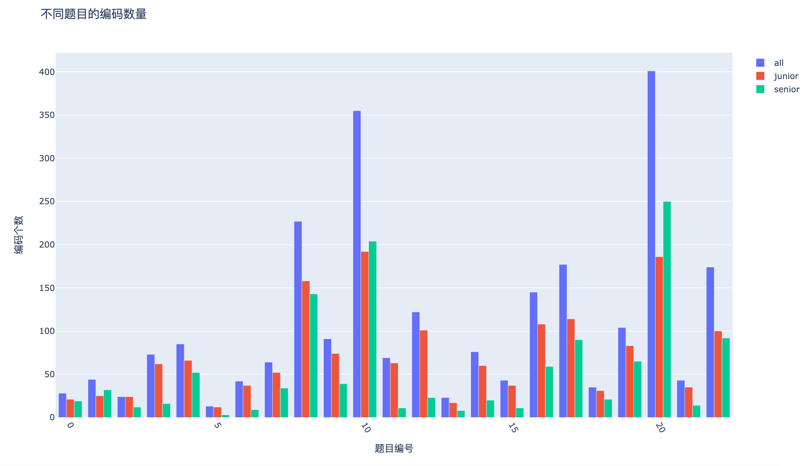

### 正确率对比

目前更新到第13题（index=12）：

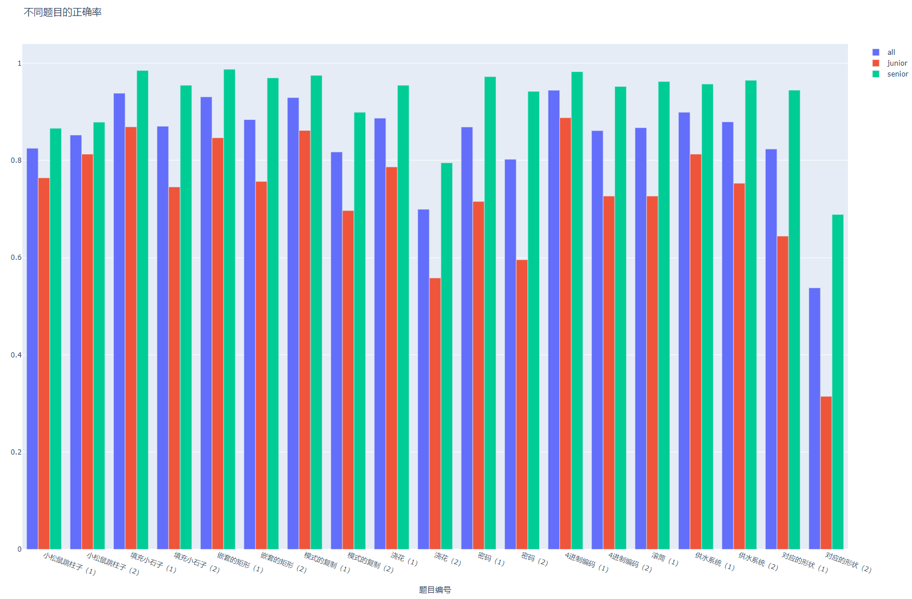

该图片文件保存为`./plot/plot_problem_accuracy.html`

#### 第10题，浇花（1）正确率：

节点编码：


| 正确答案：                                                   | 总数样本数（/占比） | 初中样本数（/占比） | 高中样本数（/占比） |
| ------------------------------------------------------------ | ------------------- | ------------------- | ------------------- |
| 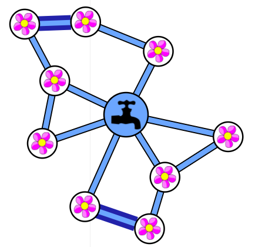（02_09,05_06) | 480/72.5%           | 158/59.2%           | 322/84.1%           |
| 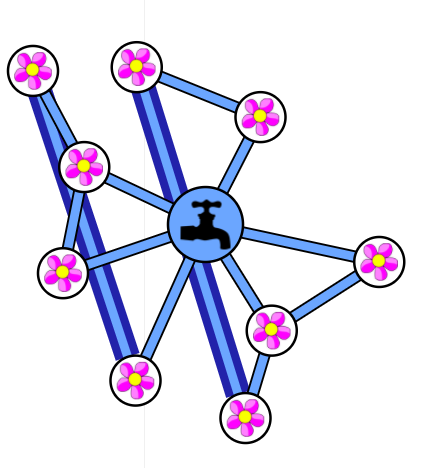(02_05,06_09) | 68/10.3%            | 37/13.9%            | 31/7.8%             |
| 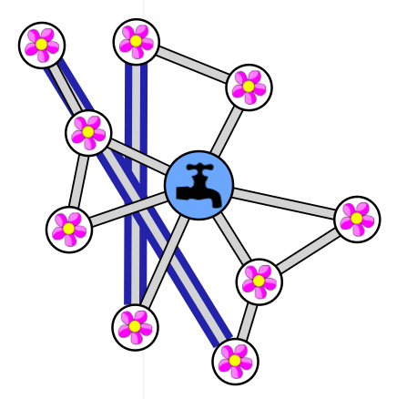(02_06,05_09) | 39/5.9%             | 4/5.6%              | 24/6.1%             |

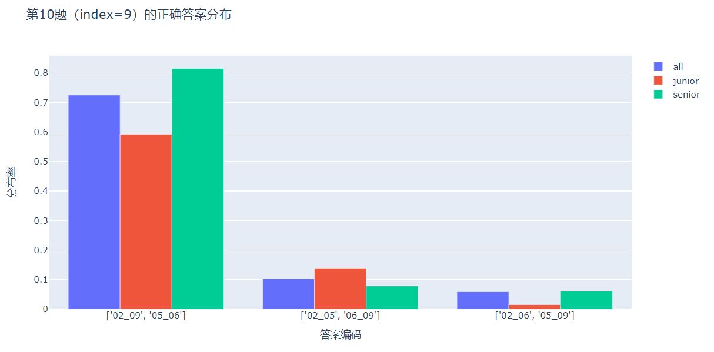

该图片存储为：`./plot/plot_problem_浇花（1）_accuracy.html`

#### 第11题，浇花（2）正确率：

节点编码为：

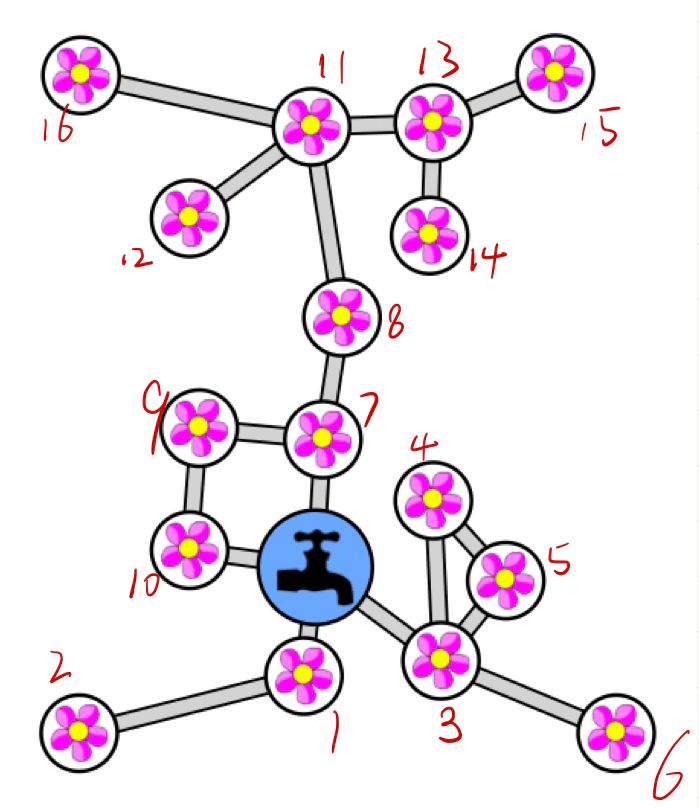


| 正确答案：                | 总数样本数（/占比） | 初中样本数（/占比） | 高中样本数（/占比） |
| ------------------------- | ------------------- | ------------------- | ------------------- |
| ['2_16', '6_15', '12_14'] | 225                 | 63                  | 162                 |
| ['2_15', '6_16', '12_14'] | 60                  | 19                  | 41                  |
| ['2_12', '6_14', '15_16'] | 51                  | 26                  | 25                  |
| ['2_12', '6_15', '14_16'] | 29                  | 4                   | 25                  |
| ['2_14', '6_12', '15_16'] | 25                  | 15                  | 10                  |
| ['2_14', '6_15', '12_16'] | 22                  | 7                   | 15                  |
| ['2_16', '6_14', '12_15'] | 15                  | 4                   | 11                  |
| ['2_15', '6_14', '12_16'] | 15                  | 6                   | 9                   |
| ['2_14', '6_16', '12_15'] | 8                   | 2                   | 6                   |
| ['2_15', '6_12', '14_16'] | 7                   | 2                   | 5                   |
| ['2_6', '12_14', '15_16'] | 3                   | 0                   | 3                   |
| ['2_6', '12_16', '14_15'] | 2                   | 0                   | 2                   |
| ['2_6', '12_15', '14_16'] | 0                   | 0                   | 0                   |
| ['2_16', '6_12', '14_15'] | 0                   | 0                   | 0                   |
| ['2_12', '6_16', '14_15'] | 0                   | 0                   | 0                   |


图片文件存储为：`./plot/plot_problem_浇花（2）_accuracy.html`


#### 第16（供水系统（1））、17（供水系统（2））题对应index=18、19

第16题（供水系统1）答案应为

| 正确答案：          | 总数样本数（/占比） | 初中样本数（/占比） | 高中样本数（/占比） |
| ------------------- | ------------------- | ------------------- | ------------------- |
| [[[2, 2, 0]], None] | 161                 | 77                  | 84                  |
| [[[0, 0, 2]], None] | 107                 | 33                  | 74                  |
| [[[0, 2, 0]], None] | 89                  | 24                  | 65                  |
| [[[2, 0, 2]], None] | 68                  | 25                  | 43                  |
| [[[0, 2, 2]], None] | 51                  | 18                  | 38                  |
| [[[0, 0, 0]], None] | 42                  | 18                  | 24                  |
| [[[2, 2, 2]], None] | 41                  | 18                  | 23                  |
| [[[2, 0, 0]], None] | 36                  | 9                   | 27                  |

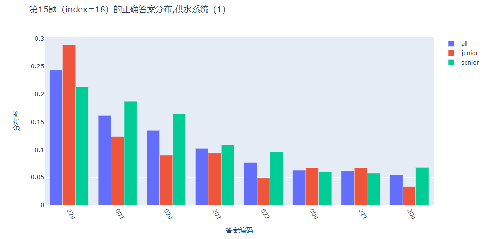

图片文件存储为：`./plot/plot_problem_供水系统（1）_accuracy.html`

#### 

#### 第17题正确答案共64种：


图片文件存储为：`./plot/plot_problem_供水系统（2）_accuracy.html`

#### 

#### 第18题和第19题对应index=21、22

第18题只有一种正确答案

但是第19题可能具有多种正确答案

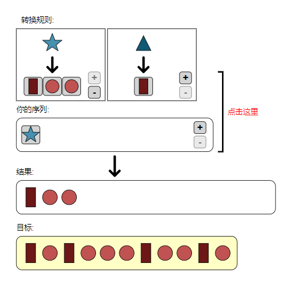

将五角星编码为'0'，将三角形编码为'1'

则最终的五角星三角形序列则可能有$2^9-2$种可能
$$
2^8+2^7+....+2^1=2^9-2
$$
同时，将长方形编码为1；圆形编码为0。五角星和三角形的编码有$2^4-2$种可能

那么遍历这些编码，找出所有的正确编码

```python
# 所有可能的五角星（0,a）和三角形（1,b）组合
seq_list = []
for i in range(8):
    for j in range(int(math.pow(2,i+1))):
        temp=str(bin(j))[2:].zfill(i+1).replace('0','a')
        temp = temp.replace('1', 'b')
        seq_list.append(temp)
# 所有可能的长方形（1）和圆形（0）组合
trans_list = []
for i in range(3):
    for j in range(int(math.pow(2,i+1))):
        trans_list.append(str(bin(j))[2:].zfill(i+1))
# 正确序列 
verify_str = '10100010010'
right_ans = []
cnt = 0
for seq in seq_list:
    for star in trans_list:
        for trian in trans_list:
            cnt +=1
            if seq.replace('a', star).replace('b', trian) == verify_str:
                right_ans.append([seq.replace('a','0').replace('b','1'), star, trian])
right_ans
```

通过遍历，得出正确答案只有两种：

[['0011010', '10', '0']

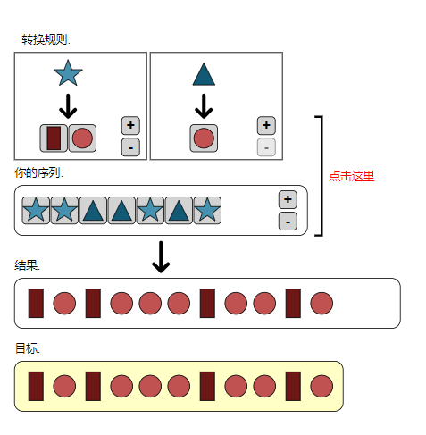

['1100101', '0', '10']]


图片文件存储为：`./plot/plot_problem_对应的形状（2）_accuracy.html`

#### 

