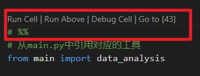
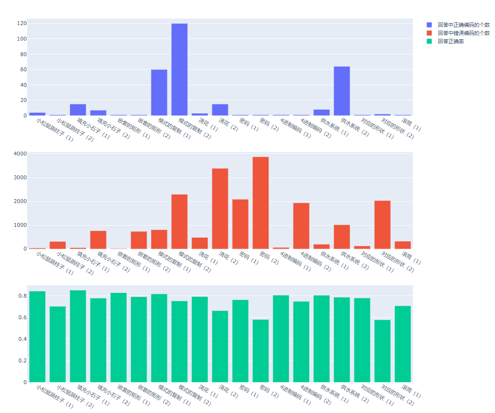
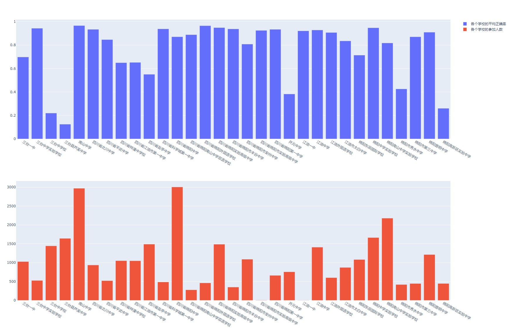
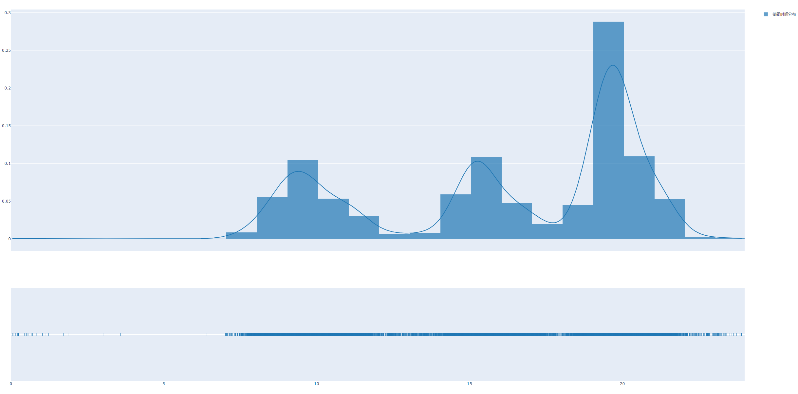

# 计算思维数据处理（结果数据处理）

【计算思维数据处理】


先转换为单题的单个字符一列的excel；只提取出有效值；例如frame\":{\"successRate\":,\"minJumps\":,\"jumps\，这些说明字段删去；整理完之后先返回一个表格。增加一列，正确与否，正确的这一列给1，不正确的给0；


【数据分析】

1、每个题的平均作答时长；——结果数据

2、每个题的编码种类（有多少种，分别是什么，每种多少学生）；——结果数据

3、每个题的每个操作步骤的平均作答时长；——过程数据

4、正确率（暂未提供标准编码，可以探索一下题目本身，协助形成标准答案编码）；——结果数据

5、关键节点（通过数据，探索学生在从初始状态向终止状态进行的过程中，有几个关键步骤，每个关键步骤有几种类型的关键节点编码），体现“用数据说话”去探索关键节点。——过程数据

6、每个题目的每种编码下，都有什么样的学生作答类型，比如都是正确的，但是可以聚成多少类，每一类有什么特征，学生是通过什么样的操作路径到达最终的。


【附加需求】

1.学生的作答时间段，比如都是在一天的哪个时间段作答的，24小时里的平均作答人数（不管哪天，只要在那个小时里就统计进去），给个柱状图的比例。

2.另外所有出图的数据能否把excel表格放上去，比如1的出图数据，每小时的人数，就给个excel表格在仓库里。

## 1、代码说明

数据的初步读取封装过程封装为一个python类（类名为`data_analysis`，位于`main.py`内）。这样的优势在于当想分析不同学校的作答情况时，可以重复使用代码。

旧版代码写为jupyter notebook形式，但是为了简化环境安装，这里采用vscode interactive file的形式，用法和jupyter notebook相似，当在`.py`文件任意位置插入：

```python
# %%
```

即可识别为一个独立代码块，具体效果在vscode 中显示如下：



红色框内为可独立执行按钮。

## 2、数据分析

主文件为`main_run.py`，其中引用到了`main.py`中定义的`data_analysis`类

```python
# 从main.py中引用对应的工具
from main import data_analysis
# 首先将excel文件读取为pandas的dataframe类型
# 然后将该dataframe作为参数以初始化对应的数据处理工具，这里没有对excel文件进行预处理，
#   超时数据还未删除，并且并没有对不同学校进行学生分类，所以命名为'df_all'
df_all = pd.read_excel('./data/ticket_user_mianyang.xlsx')  
# dataframe并不直接对其进行处理，而是作为参数初始化一个类的实体，这样的好处是可以避免大量的代码冗余
#    在对不同学校和不同数据行进行分类后处理时，只需要额外生成新的类的实体即可
#    在这里对应所有数据行直接生成一个实体，命名为'df_all_entity'
#    注意在参数里有一个命名为'name'的参数，这里是方便在调试过程中快速判断出问题的是哪个dataframe
df_all_entity =  data_analysis(df = df_all, name = 'all')
# 该步骤运行时间较长，在32秒左右
```

紧接着开始计算每一道题的正确率，判断正确与否的代码写在for循环中

循环结束，每一道题的做题情况以及每种编码对应的频次和正确与否会被保存在`/output/all_acc/`文件夹下，例如`0_acc.xlsx`代表第一题的做题情况

| list                       | count | ratio    | success |
| -------------------------- | ----- | -------- | ------- |
| [1, 2, 2, [2, 0, 1]]       | 15067 | 47.69547 | 1       |
| [1, 2, 2, [1, 3, 2]]       | 5152  | 16.30896 | 1       |
| [1, 2, 2, [2, 1, 0]]       | 4725  | 14.95726 | 1       |
| [0, 2, 4, [0, 1, 2, 3, 4]] | 2285  | 7.233302 | 0       |
| [1, 2, 2, [3, 1, 0]]       | 1713  | 5.422602 | 1       |
| [0, 2, 3, [1, 2, 3, 4]]    | 1082  | 3.425135 | 0       |
| [0, 2, 4, [4, 0, 1, 2, 3]] | 189   | 0.598291 | 0       |
| [0, 2, 3, [3, 0, 1, 2]]    | 158   | 0.500158 | 0       |
| [0, 2, 3, [0, 3, 1, 2]]    | 121   | 0.383033 | 0       |
| [0, 2, 3, [0, 2, 3, 4]]    | 91    | 0.288066 | 0       |
| [0, 2, 4, [4, 3, 2, 1, 0]] | 88    | 0.278569 | 0       |
| [0, 2, 3, [0, 2, 4, 3]]    | 87    | 0.275404 | 0       |
| [0, 2, 3, [0, 3, 2, 1]]    | 62    | 0.196265 | 0       |

list表示做题编码，count表示出现频次，ratio表示该答案占比，success表示该答案是否正确

目前第五题（预测）和第21、22题（滚筒二、滚筒三）数据不全，没有分析，但是对于滚筒二和滚筒三有正确编码的分析。

### 2.1 最终各个题目正确率、正确编码和错误编码的个数（总计）：

题目个数为： 22（目前正确率为19道题目） 参与答题总次数： 31590

```python
[('小松鼠跳柱子（1）', 0.8438429882874328),
 ('小松鼠跳柱子（2）', 0.703102247546692),
 ('填充小石子（1）', 0.8526432415321304),
 ('填充小石子（2）', 0.7790756568534346),
 ('嵌套的矩形（1）', 0.8290281734726179),
 ('嵌套的矩形（2）', 0.7917695473251029),
 ('模式的复制（1）', 0.8182969294080406),
 ('模式的复制（2）', 0.7529597974042419),
 ('浇花（1）', 0.79335232668566),
 ('浇花（2）', 0.6631212408990187),
 ('密码（1）', 0.7637543526432415),
 ('密码（2）', 0.581354859132637),
 ('4进制编码（1）', 0.8064577397910732),
 ('4进制编码（2）', 0.749002849002849),
 ('供水系统（1）', 0.8051915163026274),
 ('供水系统（2）', 0.7874327318771763),
 ('对应的形状（1）', 0.7801836024058246),
 ('对应的形状（2）', 0.5787907565685343),
 ('滚筒（1）', 0.7078189300411523)]
```




|                   | 回答中正确编码的个数 | 回答中错误编码的个数 | 回答正确率 |
| ----------------- | -------------------- | -------------------- | ---------- |
| 小松鼠跳柱子（1） | 4                    | 40                   | 0.847027   |
| 小松鼠跳柱子（2） | 1                    | 314                  | 0.706791   |
| 填充小石子（1）   | 15                   | 53                   | 0.857313   |
| 填充小石子（2）   | 7                    | 762                  | 0.783922   |
| 嵌套的矩形（1）   | 1                    | 18                   | 0.834838   |
| 嵌套的矩形（2）   | 1                    | 726                  | 0.797691   |
| 模式的复制（1）   | 60                   | 801                  | 0.824552   |
| 模式的复制（2）   | 120                  | 2277                 | 0.759222   |
| 浇花（1）         | 3                    | 483                  | 0.800755   |
| 浇花（2）         | 15                   | 3362                 | 0.669934   |
| 密码（1）         | 1                    | 2076                 | 0.771734   |
| 密码（2）         | 1                    | 3848                 | 0.588224   |
| 4进制编码（1）    | 1                    | 63                   | 0.816007   |
| 4进制编码（2）    | 1                    | 1924                 | 0.758158   |
| 供水系统（1）     | 8                    | 199                  | 0.815104   |
| 供水系统（2）     | 64                   | 1011                 | 0.797175   |
| 对应的形状（1）   | 1                    | 128                  | 0.790178   |
| 对应的形状（2）   | 2                    | 2025                 | 0.586902   |
| 滚筒（1）         | 1                    | 324                  | 0.71769    |

### 2.2 不同学校之间的平均正确率和参加人数对比：




|                            | 各个学校的平均正确率 | 各个学校的参加人数 |
| -------------------------- | -------------------- | ------------------ |
| 三台一中                   | 0.713869             | 992                |
| 三台中学实验学校           | 0.943766             | 526                |
| 三台中学校                 | 0.212241             | 1412               |
| 三台县芦溪中学             | 0.125066             | 1600               |
| 南山中学                   | 0.968805             | 2961               |
| 四川省北川中学             | 0.938785             | 932                |
| 四川省平武中学             | 0.847672             | 520                |
| 四川省梓潼中学校           | 0.692567             | 951                |
| 四川省江油市第一中学       | 0.653811             | 1044               |
| 四川省盐亭中学             | 0.555548             | 1462               |
| 四川省科学城第一中学       | 0.940844             | 484                |
| 四川省绵阳中学             | 0.874644             | 2973               |
| 四川省绵阳南山中学双语学校 | 0.90242              | 274                |
| 四川省绵阳外国语学校       | 0.968008             | 459                |
| 四川省绵阳实验高级中学     | 0.951677             | 1478               |
| 四川省绵阳市丰谷中学       | 0.939871             | 344                |
| 四川省绵阳市安州中学       | 0.822029             | 1067               |
| 四川省绵阳市实验高级中学   | 0.924812             | 7                  |
| 四川省绵阳第一中学         | 0.939401             | 654                |
| 开元中学                   | 0.390466             | 721                |
| 江油一中                   | 0.921053             | 4                  |
| 江油中学                   | 0.9298               | 1402               |
| 江油外国语学校             | 0.910931             | 598                |
| 江油市太白中学             | 0.834978             | 864                |
| 绵阳东辰国际学校           | 0.737557             | 1030               |
| 绵阳中学实验学校           | 0.94778              | 1661               |
| 绵阳南山中学实验学校       | 0.823769             | 2081               |
| 绵阳市秀水中学             | 0.427742             | 417                |
| 绵阳市第三中学             | 0.884042             | 438                |
| 绵阳普明中学               | 0.911889             | 1209               |
| 绵阳高新区实验中学         | 0.260685             | 447                |

### 2.3 作答时间段分析



|      | count |
| ---- | ----- |
| 0    | 17    |
| 1    | 5     |
| 2    | 0     |
| 3    | 2     |
| 4    | 1     |
| 5    | 0     |
| 6    | 1     |
| 7    | 231   |
| 8    | 1538  |
| 9    | 3323  |
| 10   | 1654  |
| 11   | 1050  |
| 12   | 204   |
| 13   | 234   |
| 14   | 1619  |
| 15   | 3546  |
| 16   | 1476  |
| 17   | 631   |
| 18   | 1159  |
| 19   | 8665  |
| 20   | 3728  |
| 21   | 1803  |
| 22   | 83    |
| 23   | 42    |

## 3、特殊题目分析

### 第19题 对应的形状（2）

经过遍历分析，共有两种正确答案

```python
# 模拟第19题的答案编码，遍历所有答案
# 所有可能的五角星（0,a）和三角形（1,b）组合
seq_list = []
for i in range(8):
    for j in range(int(math.pow(2,i+1))):
        temp=str(bin(j))[2:].zfill(i+1).replace('0','a')
        temp = temp.replace('1', 'b')
        seq_list.append(temp)
# 所有可能的长方形（1）和圆形（0）组合
trans_list = []
for i in range(3):
    for j in range(int(math.pow(2,i+1))):
        trans_list.append(str(bin(j))[2:].zfill(i+1))
# 正确序列 
verify_str = '10100010010'
right_ans = []
cnt = 0
for seq in seq_list:
    for star in trans_list:
        for trian in trans_list:
            cnt +=1
            if seq.replace('a', star).replace('b', trian) == verify_str:
                right_ans.append([seq.replace('a','0').replace('b','1'), star, trian])
right_ans
```


```python

[['0011010', '10', '0'], ['1100101', '0', '10']]
```


### 滚筒（2）

经过遍历分析，共有8种正确编码：

```python
posible_roll1_roll2
[({'color_list': [0, 1], 'start': 0, 'end': 15},
  {'color_list': [1, 2, 2, 0, 1], 'start': 3, 'end': 12}),
 ({'color_list': [0, 1, 0, 1], 'start': 0, 'end': 15},
  {'color_list': [1, 2, 2, 0, 1], 'start': 3, 'end': 12}),
 ({'color_list': [0, 1], 'start': 0, 'end': 15},
  {'color_list': [1, 2, 2, 0, 1], 'start': 3, 'end': 13}),
 ({'color_list': [0, 1, 0, 1], 'start': 0, 'end': 15},
  {'color_list': [1, 2, 2, 0, 1], 'start': 3, 'end': 13}),
 ({'color_list': [0, 1], 'start': 0, 'end': 15},
  {'color_list': [2, 2, 0, 1, 1], 'start': 4, 'end': 12}),
 ({'color_list': [0, 1, 0, 1], 'start': 0, 'end': 15},
  {'color_list': [2, 2, 0, 1, 1], 'start': 4, 'end': 12}),
 ({'color_list': [0, 1], 'start': 0, 'end': 15},
  {'color_list': [2, 2, 0, 1, 1], 'start': 4, 'end': 13}),
 ({'color_list': [0, 1, 0, 1], 'start': 0, 'end': 15},
  {'color_list': [2, 2, 0, 1, 1], 'start': 4, 'end': 13})]
```


### 滚筒（3）

经过遍历分析，共有15种正确编码

```python
[({'color_list': [1, 0], 'start': 0, 'end': 19},
  {'color_list': [2, 1, 0, 2], 'start': 3, 'end': 18},
  {'color_list': [1, 2, 0], 'start': 8, 'end': 12}),
 ({'color_list': [1, 0, 1], 'start': 0, 'end': 19},
  {'color_list': [2, 1, 0, 2], 'start': 3, 'end': 18},
  {'color_list': [1, 2, 0], 'start': 8, 'end': 12}),
 ({'color_list': [1, 0, 1, 0], 'start': 0, 'end': 19},
  {'color_list': [2, 1, 0, 2], 'start': 3, 'end': 18},
  {'color_list': [1, 2, 0], 'start': 8, 'end': 12}),
 ({'color_list': [1, 0], 'start': 0, 'end': 19},
  {'color_list': [2, 1, 0, 2], 'start': 3, 'end': 18},
  {'color_list': [1, 2, 0], 'start': 8, 'end': 13}),
 ({'color_list': [1, 0, 1], 'start': 0, 'end': 19},
  {'color_list': [2, 1, 0, 2], 'start': 3, 'end': 18},
  {'color_list': [1, 2, 0], 'start': 8, 'end': 13}),
 ({'color_list': [1, 0, 1, 0], 'start': 0, 'end': 19},
  {'color_list': [2, 1, 0, 2], 'start': 3, 'end': 18},
  {'color_list': [1, 2, 0], 'start': 8, 'end': 13}),
 ({'color_list': [1, 0], 'start': 0, 'end': 19},
  {'color_list': [2, 1, 0, 2], 'start': 3, 'end': 18},
  {'color_list': [2, 0, 1], 'start': 9, 'end': 12}),
 ({'color_list': [1, 0, 1], 'start': 0, 'end': 19},
  {'color_list': [2, 1, 0, 2], 'start': 3, 'end': 18},
  {'color_list': [2, 0, 1], 'start': 9, 'end': 12}),
 ({'color_list': [1, 0, 1, 0], 'start': 0, 'end': 19},
  {'color_list': [2, 1, 0, 2], 'start': 3, 'end': 18},
  {'color_list': [2, 0, 1], 'start': 9, 'end': 12}),
 ({'color_list': [1, 0], 'start': 0, 'end': 19},
  {'color_list': [2, 1, 0, 2], 'start': 3, 'end': 18},
  {'color_list': [2, 0, 1], 'start': 9, 'end': 13}),
 ({'color_list': [1, 0, 1], 'start': 0, 'end': 19},
  {'color_list': [2, 1, 0, 2], 'start': 3, 'end': 18},
  {'color_list': [2, 0, 1], 'start': 9, 'end': 13}),
 ({'color_list': [1, 0, 1, 0], 'start': 0, 'end': 19},
  {'color_list': [2, 1, 0, 2], 'start': 3, 'end': 18},
  {'color_list': [2, 0, 1], 'start': 9, 'end': 13}),
 ({'color_list': [1, 0], 'start': 0, 'end': 19},
  {'color_list': [2, 1, 0, 2], 'start': 3, 'end': 18},
  {'color_list': [2, 0, 1, 2], 'start': 9, 'end': 12}),
 ({'color_list': [1, 0, 1], 'start': 0, 'end': 19},
  {'color_list': [2, 1, 0, 2], 'start': 3, 'end': 18},
  {'color_list': [2, 0, 1, 2], 'start': 9, 'end': 12}),
 ({'color_list': [1, 0, 1, 0], 'start': 0, 'end': 19},
  {'color_list': [2, 1, 0, 2], 'start': 3, 'end': 18},
  {'color_list': [2, 0, 1, 2], 'start': 9, 'end': 12})]
```

