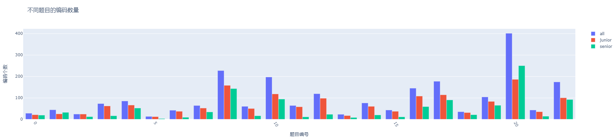
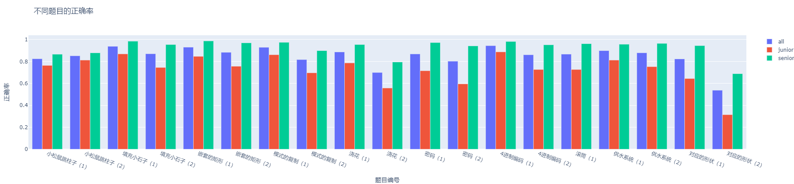
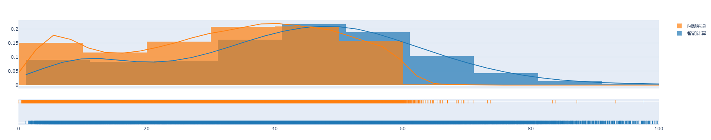
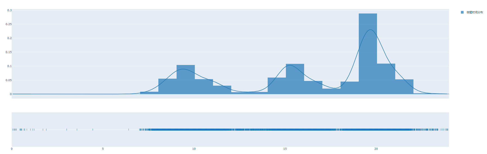
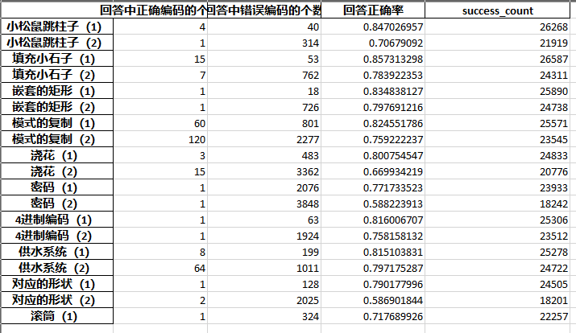
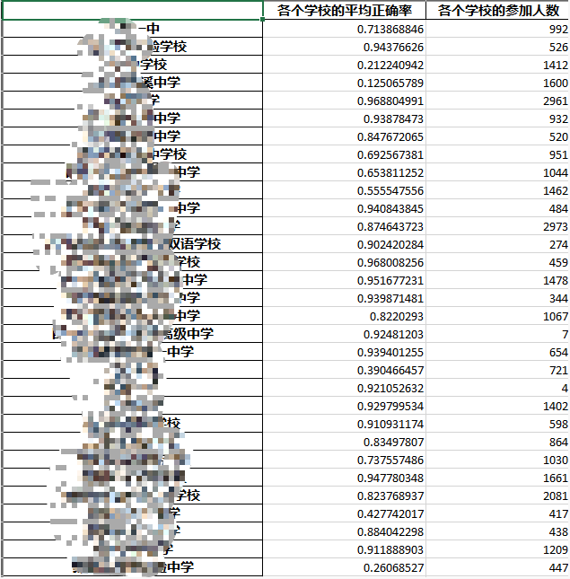
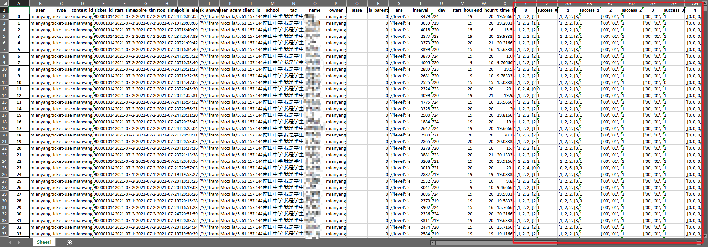

# openda1
Data analysis warehouse.

# 项目信息

- 项目名称：OpenCT教育大数据分析及可视化模型；项目编号：2111508861623240518014

- 方案描述：

  使用pandas进行学生作答结果数据和过程数据处理，提取结果数据作答信息关键字，并对统一做答信息进行题目分类和正确率分析，采用面向对象的编程思想将数据分析工具封装成python类方便迭代；提取过程数据关键字并根据作答数据结合具体题目信息对过程数据作答结果进行分析，分析学生作答关键答案节点和进行学生思维数据挖掘。最终，将分析工具通过Qt封装为可视化可执行程序。

- 时间规划：

| 时间段                | 工作内容                                                     | 完成情况 |
| --------------------- | ------------------------------------------------------------ | -------- |
| 2021-07-01~2021-07-15 | 对“智能计算素养”结果数据表格进行分析，初步完成数据处理的python工具，分离主键为学生的作答数据为主键为题目编号的作答统计数据，并保存。 | 已完成   |
| 2021-07-15~2021-07-31 | 对“智能计算素养”和“人文素养”的综合结果数据进行分析，得出二者对比的统计结果（正确率、作答人数和作答时间等），并提供日报所需数据和可视化图表。 | 已完成   |
| 2021-08-01~2021-08-15 | 对“智能计算素养”结果数据表格进行进一步分析，细化每一道题的正确编码和错误编码，对每一道题的正确率进行分析，并保存为原始数据的22列 | 已完成   |
| 2021-08-15~2021-08-31 | 基于python Qt初步编写可视化软件，将目前分析代码移植为可视化可执行程序。 | 待完成   |
| 2021-09-01~2021-09-15 | 基于pytorch寻找适合处理过程数据的深度神经网络，寻找学生作答规律，给教育者使用提出抽象层建议 | 待完成   |
| 2021-09-15~2021-10-01 | 进行项目收尾工作，完善项目代码和文档，并上传报告和成果       | 待完成   |

# 项目进度

- 已完成的工作：

  对“智能计算素养”结果数据表格进行分析，初步完成数据处理的python工具，分离主键为学生的作答数据为主键为题目编号的作答统计数据，并保存为excel。分析代码在根目录下的`first_analysis`文件夹下，采用jupyter notebook的方式进行代码展示，并将数据分析工具的python类封装到`main.py`中

  ​	分析结果举例：

  |  |
  | ------------------------------------------------------------ |
  | 题目编码种类的分析（分全部、高中、初中三类进行分析）         |
  |  |
  | 不同题目正确率的分析（分全部、高中、初中三类进行分析）       |

  对“智能计算素养”和“人文素养”的综合结果数据进行分析，得出二者对比的统计结果（正确率、作答人数和作答时间等），并提供日报所需数据和可视化图表。分析代码在`20210725`文件夹下，采用jupyter notebook的方式进行绘图，绘图完成之后保存至`plot`文件夹下。

  ​	分析结果举例：

  |  |
  | ------------------------------------------------------------ |
  | 做题用时时间分布（智能计算和问题解决两套卷子）               |
  |  |
  | 做题用时分布（饼图）                                         |

  对“智能计算素养”结果数据表格进行进一步分析，细化每一道题的正确编码和错误编码，对每一道题的正确率进行分析，并保存为原始数据的22列。分析代码在`20210809`文件夹下，基于`first_analysis`中的分析代码进行改进，所有分析函数和判断正确率的函数均放在一个类中。增加了将22道题目的作答情况和正确状态添加到原始数据中的功能；统计性结果在`20210803`中给出

  分析结果举例：

  |  智能计算做题时间分布 |
  | ------------------------------------------------------------ |
  |                                                              |
  |  |
  | 保存题目分析结果为excel文档（自动生成）                      |
  |  |
  | 分学校统计做题情况                                           |
  |  |
  | 将作答情况和正确与否添加到原始数据中                         |

  

- 遇到的问题和解决方案：

发现数据中的噪声数据：

​	初步通过判断语句过滤，下一步通过改进采用python中的`try`语句实现噪声数据的跳过。

发现“智能计算素养”中的前端数据反馈问题：

​	《预测》一题中的反馈结果有问题，由于题目每次是随机变化的，所以并不存在固定的正确编码，但是反馈数据中并没有包含题目状态，导致正确率无法分析。

​	《滚筒（2）》、《滚筒（3）》中前端反馈数据只有第一个滚筒的状态，导致了正确率无法分析。

​	目前以就该问题和出题人进行协商，并提出了过渡方案。

通过pandas只能进行单线程分析，导致处理过于缓慢：

​	下一步拟采取基于pyspark的方式对数据进行map-reduce方式的多线程分析。

- 后续工作安排：

基于python Qt初步编写可视化软件，将目前分析代码移植为可视化可执行程序。基于pytorch寻找适合处理过程数据的深度神经网络，寻找学生作答规律，给教育者使用提出抽象层建议。进行项目收尾工作，完善项目代码和文档，并上传报告和成果